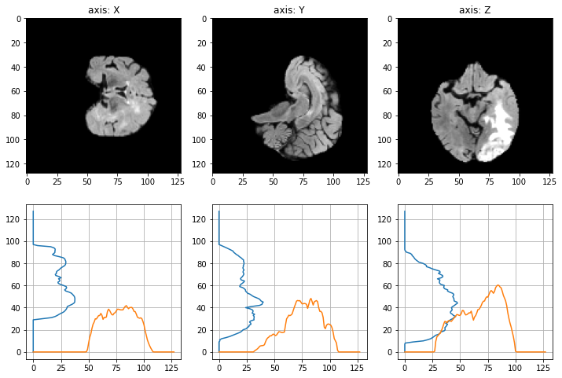
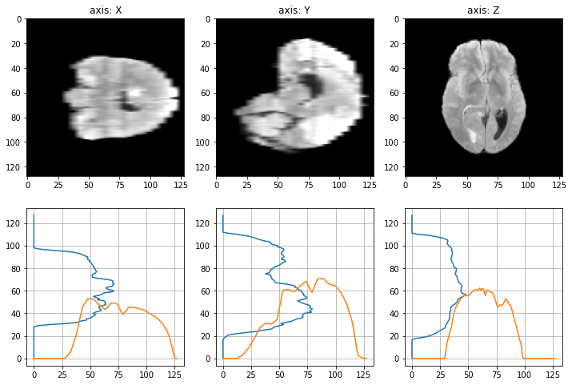
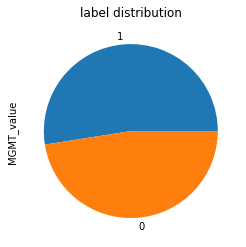
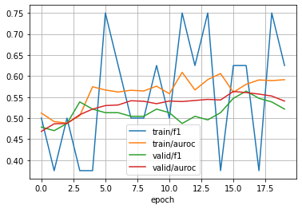

# Kaggle: [Brain Tumor Radiogenomic Classification](https://www.kaggle.com/c/rsna-miccai-brain-tumor-radiogenomic-classification)

[](https://github.com/Borda/kaggle_brain-tumor-3D/actions/workflows/ci_testing.yml)
[](https://github.com/Borda/kaggle_brain-tumor-3D/actions/workflows/code-format.yml)
[](https://codecov.io/gh/Borda/kaggle_brain-tumor-3D)
[](https://results.pre-commit.ci/latest/github/Borda/kaggle_brain-tumor-3D/main)

The goal of this challenge is to Predict the status of a genetic biomarker important for brain cancer treatment.



With interpolation in Z dimension as it happens it is quite sparse:


Each independent case has a dedicated folder identified by a five-digit number.
Within each of these “case” folders, there are four sub-folders, each of them corresponding to each of the structural multi-parametric MRI (mpMRI) scans, in DICOM format.
The exact mpMRI scans included are:

- **FLAIR**: Fluid Attenuated Inversion Recovery
- **T1w**: T1-weighted pre-contrast
- **T1Gd**: T1-weighted post-contrast
- **T2**: T2-weighted

The labels/targets are `MGMT_value`:



## Experimentation

### install this tooling

A simple way how to use this basic functions:

```bash
! pip install https://github.com/Borda/kaggle_brain-tumor-3D/archive/refs/heads/main.zip
```

### run notebooks in Kaggle

- [Brain Tumor Classif. ~ Lightning⚡EfficientNet3D](https://www.kaggle.com/jirkaborovec/brain-tumor-classif-lightning-efficientnet3d)

### local notebooks

- [Brain tumor classification meets PT-Lightning and EfficientNet3D](notebooks/Brain-tumor-classif_PT-Lightning_EfficientNet3D.ipynb)
- [Brain tumor classification meets PT-Lightning and pre-trained ResNet3D](notebooks/Brain-tumor-classif_PT-Lightning_ResNet3D.ipynb)

### some results

Training progress with EfficientNet3D with training  for 10 epochs > over 96% validation accuracy:


